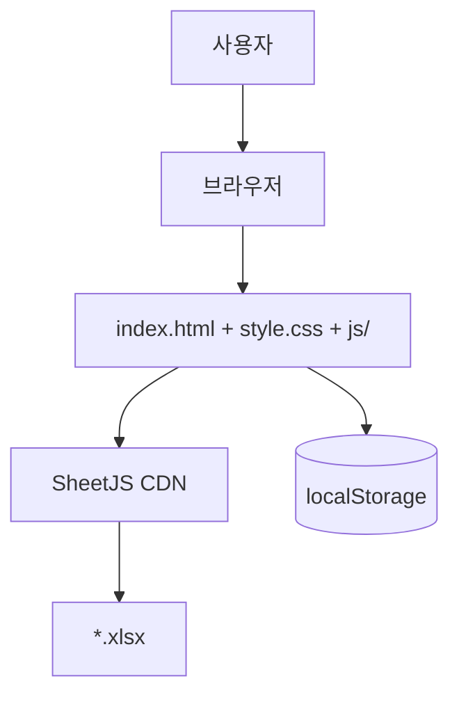

# SRD — Software Requirements Document

## 문서 정보

| 항목 | 내용 |
|------|------|
| 시스템명 | Mini Spreadsheet |
| 문서 버전 | 2.0 |
| 작성 기준 | 저장소 현재 구현 |
| 상위 문서 | [PRD.md](./PRD.md) |
| 하위 문서 | [TRD.md](./TRD.md) |

---

## 1. 시스템 개요

정적 SPA에 가까운 단일 페이지 앱이다. `js/` ES modules(`SpreadsheetApp`, `SpreadsheetModel` 등)가 상태·렌더·이벤트·Export·`localStorage`를 담당하고, Excel 생성만 **SheetJS**(CDN)에 위임한다.



---

## 2. 기능 요구사항

### 2.1 그리드·편집

| ID | 요구사항 | 우선순위 | 수용 기준 |
|----|----------|----------|-----------|
| FR-001 | `CONFIG` 기본값으로 그리드를 렌더링한다. | 필수 | 기본 5×5 |
| FR-002 | 각 데이터 셀은 `textarea`로 텍스트 입력·수정이 가능하다. | 필수 | 여러 줄·Enter 동작 정의 준수 |
| FR-003 | 단일 셀 선택 시 `#cell-coordinate`에 `Cell: {열}{행}`을 표시한다. | 필수 | 예: `Cell: C1` |
| FR-004 | 다중 셀·범위 선택 시 `Selection: {시작}:{끝}`을 표시한다. | 필수 | 예: `Selection: A1:C3` |
| FR-005 | 단일 셀·`range` 선택 시 해당 **열·행 헤더를 동시**에 강조한다. | 필수 | PRD F-04 |
| FR-006 | 단일 셀 선택 시 해당 행·열 방향 셀 가이드(`highlight-row/col`)를 표시할 수 있다. | 필수 | 시각적 교차 강조 |
| FR-007 | 선택 모드에서 Enter(단독)는 **편집 모드**로 진입한다. | 필수 | `enterEditMode` |
| FR-007b | 편집 모드에서 Enter(단독)는 편집 종료 후 **아래 셀**로 이동한다. | 필수 | `finishEditAndMoveDown` |
| FR-008 | Cmd/Ctrl+Enter는 셀 내 줄바꿈을 삽입한다. | 필수 | |
| FR-009 | 편집 중 셀 단위 붙여넣기는 줄바꿈을 공백으로 평탄화한다. | 필수 | 단일 셀 paste 핸들러 |

### 2.2 선택

| ID | 요구사항 | 우선순위 | 수용 기준 |
|----|----------|----------|-----------|
| FR-010 | 셀 드래그·Shift+클릭으로 범위(`range`) 선택이 가능하다. | 필수 | |
| FR-011 | 행 헤더 클릭·드래그로 행 전체(`row`) 선택이 가능하다. | 필수 | |
| FR-012 | 열 헤더 클릭·드래그로 열 전체(`column`) 선택이 가능하다. | 필수 | |
| FR-013 | 좌상단 코너 클릭으로 전체 시트(`sheet`) 선택이 가능하다. | 필수 | |
| FR-014 | 화살표 키로 활성 셀 이동, Shift+화살표로 범위 확장이 가능하다. | 필수 | |
| FR-015 | 동일 셀 재클릭(드래그 없음) 시 편집 모드로 진입한다. | 필수 | |
| FR-016 | 선택 모드에서 인쇄 가능 문자 입력 시 편집 시작·값 대체가 가능하다. | 필수 | `startTypingInActiveCell` |

### 2.3 데이터 수집·Export

| ID | 요구사항 | 우선순위 | 수용 기준 |
|----|----------|----------|-----------|
| FR-017 | `collectSpreadsheetData()`는 `string[][]`를 반환한다. | 필수 | UI와 일치 |
| FR-018 | Export 버튼 클릭 시 `.xlsx`를 다운로드한다. | 필수 | SheetJS `writeFile` |
| FR-019 | Export 워크시트 본문은 **그리드 데이터만** 포함한다. | 필수 | 제목 행 없음 |
| FR-020 | 파일명·시트 탭명은 시트 제목을 정규화해 반영한다. | 필수 | 금지문자 제거, 공백→`_` |
| FR-021 | SheetJS 로드 실패 시 사용자에게 알림한다. | 필수 | `alert` |
| FR-022 | 제목이 비어 있으면 파일명·탭 모두 `제목없음`을 사용한다. | 필수 | `resolveExportTitle` |

### 2.4 행·열 조작

| ID | 요구사항 | 우선순위 | 수용 기준 |
|----|----------|----------|-----------|
| FR-023 | 행 헤더 오른클릭 시 행 추가·삭제 메뉴를 표시한다. | 선택 | 위/아래 추가, 삭제 |
| FR-024 | 열 헤더 오른클릭 시 열 추가·삭제 메뉴를 표시한다. | 선택 | 왼쪽/오른쪽 추가, 삭제 |
| FR-025 | 행·열 삭제 후 최소 **1행 1열**을 유지한다. | 선택 | 마지막 1행·1열일 때 컨텍스트 메뉴 삭제 항목 비활성화 |
| FR-026 | 행·열 다중 선택 시 컨텍스트 메뉴 개수에 맞춰 일괄 추가·삭제한다. | 선택 | |
| FR-027 | 마지막 행·열 헤더에서 메뉴가 화면 밖으로 나가지 않도록 위치를 보정한다. | 선택 | |

### 2.5 영속화·시트 제목

| ID | 요구사항 | 우선순위 | 수용 기준 |
|----|----------|----------|-----------|
| FR-028 | 입력·구조 변경 후 300ms debounce로 `localStorage`에 저장한다. | 선택 | `SAVE_DEBOUNCE_MS` |
| FR-029 | 키 `mini-spreadsheet-data`에 `rows`, `cols`, `data`, `title`을 저장한다. | 선택 | |
| FR-030 | 로드 시 저장값이 있으면 복원, 없으면 기본 5×5·빈 제목이다. | 선택 | |
| FR-031 | 툴바 시트 제목은 클릭 편집, 빈 값 표시는 「제목없음」이다. | 선택 | |
| FR-032 | 제목 입력 최대 80자이다. | 선택 | `maxlength` |

### 2.6 실행 취소·클립보드

| ID | 요구사항 | 우선순위 | 수용 기준 |
|----|----------|----------|-----------|
| FR-033 | Cmd/Ctrl+Z로 실행 취소, Shift+Z 또는 Ctrl+Y로 다시 실행한다. | 선택 | 스택 최대 100 |
| FR-034 | undo/redo는 `rows`, `cols`, `data` 스냅샷을 복원한다. | 선택 | 제목은 스냅샷 제외 |
| FR-035 | Cmd/Ctrl+C로 선택 영역을 TSV로 복사한다. | 선택 | |
| FR-036 | Cmd/Ctrl+V로 HTML 표·TSV·마크다운 표를 붙여넣는다. | 선택 | 구분선 행 스킵 |
| FR-037 | 붙여넣기 범위가 그리드를 넘으면 행·열을 자동 확장한다. | 선택 | `ensureGridSize` |
| FR-038 | Backspace로 선택 영역 셀 내용을 비운다. | 선택 | |

### 2.7 UI 메타

| ID | 요구사항 | 우선순위 | 수용 기준 |
|----|----------|----------|-----------|
| FR-039 | 툴바에 `N행 × M열` 크기를 표시한다. | 선택 | `#grid-size-label` |
| FR-040 | Export 버튼 라벨은 `Export Excel`이다. | 필수 | |
| FR-041 | 사용 가이드 모달이 열려 있을 때 그리드 단축키(화살표·Enter 등)는 동작하지 않는다. | 선택 | `isGridKeyboardTarget` |

---

## 3. 비기능 요구사항

| ID | 분류 | 요구사항 | 수용 기준 |
|----|------|----------|-----------|
| NFR-001 | 구조 | HTML, CSS, JavaScript 파일 분리 | `index.html` + `style.css` + `js/` + CDN 1 |
| NFR-002 | 유지보수 | `js/` 모듈·클래스 단위 역할 분리 | SpreadsheetApp·Model·UI·services |
| NFR-003 | 의존성 | 앱 로직은 Vanilla JS, Export만 SheetJS | CDN 0.20.3 |
| NFR-004 | 배포 | `index.html`로 로컬 실행 가능 | Export 시 네트워크 필요 |
| NFR-005 | UI | 데스크톱 우선, 720px/480px 이하 기본 반응형 | 툴바 줄바꿈·짧은 라벨·그리드 스크롤 |
| NFR-006 | 성능 | localStorage 저장 300ms debounce | |
| NFR-007 | 접근성 | 셀·제목에 `aria-label` 제공 | |

---

## 4. 데이터 요구사항

### 4.1 런타임 상태 (`spreadsheet`)

| 필드 | 타입 | 설명 |
|------|------|------|
| `rows`, `cols` | number | 그리드 크기 |
| `data` | `string[][]` | 셀 값 |
| `title` | string | 시트 제목 |
| `anchor`, `focus` | `{row,col}` | 선택 범위 |
| `selectionKind` | string | `range` \| `row` \| `column` \| `sheet` |
| `mode` | string | `select` \| `edit` |

### 4.2 localStorage Payload

```json
{ "rows": 5, "cols": 5, "data": [["..."]], "title": "..." }
```

### 4.3 Export

- 입력: `collectSpreadsheetData()` → `aoa_to_sheet`
- 메타: `sanitizeExportFileName`, `sanitizeWorksheetName`

---

## 5. 인터페이스 요구사항

| 요소 | ID | 요구사항 |
|------|-----|----------|
| 시트 제목 | `#sheet-title-field` | contenteditable 클릭 편집 |
| 좌표 | `#cell-coordinate` | Cell / Selection |
| 크기 | `#grid-size-label` | `N행 × M열` |
| Export | `#export-btn` | Export Excel |
| 그리드 | `#spreadsheet` | 동적 `<table>` |
| 컨텍스트 메뉴 | `#context-menu` | 행·열 헤더 전용 |

---

## 6. 제약사항

1. 서버 API 없음.
2. Undo 스냅샷에 `title` 미포함.
3. `GridRenderer.render()`는 행·열 수가 바뀌면 `renderFull()`, 크기가 같으면 `syncCellValues()`만 수행.
4. SheetJS CDN 미로드 시 Export 불가(오프라인 시 제한).

---

## 7. 검수 기준

| # | 항목 | 연관 |
|---|------|------|
| 1 | 기본 그리드 렌더 | FR-001 |
| 2 | 셀 입력·Enter·줄바꿈 | FR-002, FR-007~009, FR-007b |
| 3 | 좌표·헤더 동시 강조 | FR-003~006 |
| 4 | `collectSpreadsheetData()` 일치 | FR-017 |
| 5 | `.xlsx` Export·Sheets 연동 | FR-018~022 |
| 6 | localStorage·제목 복원 | FR-028~032 |
| 7 | 행·열 컨텍스트 메뉴 | FR-023~027 |
| 8 | undo/redo, 복사·붙여넣기 | FR-033~038 |
| 9 | HTML/CSS/JS 분리 | NFR-001 |
| 10 | README, PROMPT_LOG | 제출 |

---

## 8. PRD 추적성

| PRD | SRD |
|-----|-----|
| F-01~06 | FR-001~022, FR-040 |
| F-07 | FR-023~027 |
| F-08~09 | FR-028~029, NFR-005~006 |
| F-10 | FR-020, FR-031~032 |
| F-11 | FR-010~016 |
| F-12 | FR-033~034 |
| F-13 | FR-035~038 |
| F-14~15 | FR-041, NFR-005 |
