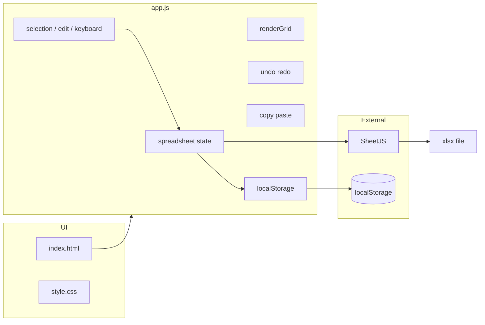

# TRD — Technical Design Document

## 문서 정보

| 항목 | 내용 |
|------|------|
| 시스템명 | Mini Spreadsheet |
| 문서 버전 | 2.0 |
| 작성 기준 | 저장소 현재 구현 |
| 상위 문서 | [PRD.md](./PRD.md), [SRD.md](./SRD.md) |

---

## 1. 기술 개요

| 항목 | 내용 |
|------|------|
| 프론트엔드 | HTML5, CSS3, ECMAScript (Vanilla) |
| Export | [SheetJS](https://cdn.sheetjs.com/) `xlsx-0.20.3` (CDN) |
| 상태 | 인메모리 `spreadsheet` + `localStorage` |
| 빌드 | 없음 (네이티브 ES modules) |
| 모듈 | `js/` — 클래스·역할별 파일 분리 |

---

## 2. 아키텍처



### 2.1 책임

| 파일 | 책임 |
|------|------|
| `index.html` | 툴바, 그리드 마운트, 컨텍스트 메뉴, SheetJS·`app.js` 로드 |
| `style.css` | 그리드·선택·헤더·툴바·메뉴 스타일 |
| `js/*` | ES modules — `SpreadsheetApp` 조율, `SpreadsheetModel` 상태, UI·services |

---

## 3. 디렉터리 구조

```
mini-spread-sheet/
├── index.html
├── style.css
├── js/
│   ├── main.js
│   ├── SpreadsheetApp.js
│   ├── constants.js
│   ├── models/ · services/ · ui/ · utils/
├── README.md
├── AGENTS.md
├── docs/
└── exports/
```

---

## 4. 상수 및 상태

### 4.1 상수

```javascript
const CONFIG = { defaultRows: 5, defaultCols: 5 };
const STORAGE_KEY = 'mini-spreadsheet-data';
const SAVE_DEBOUNCE_MS = 300;
const DEFAULT_SHEET_TITLE_LABEL = '제목없음';
const MAX_UNDO_STACK = 100;
```

### 4.2 `spreadsheet`

```javascript
let spreadsheet = {
  rows, cols,
  data,           // string[][]
  title,          // string
  anchor, focus,  // { row, col }
  selectionKind,  // 'range' | 'row' | 'column' | 'sheet'
  mode,           // 'select' | 'edit'
};
```

### 4.3 보조 상태

| 객체 | 용도 |
|------|------|
| `history.undoStack` / `redoStack` | `{ rows, cols, data }` 스냅샷 |
| `dragSelection` | 드래그 선택·재클릭 편집 판별 |
| `contextMenuState` | `{ type: 'row'\|'column', index }` |

---

## 5. UI 구조 (`index.html`)

| 영역 | 요소 | 비고 |
|------|------|------|
| 1행 툴바 | `#sheet-title-wrap`, `#export-btn` | 제목 + Export |
| 2행 툴바 | `#cell-coordinate`, `#grid-size-label` | 좌표 + 크기 |
| 본문 | `#spreadsheet` | `<table class="grid-table">` |
| 플로팅 | `#context-menu` | 행·열 헤더용 |

스크립트: SheetJS CDN → `<script type="module" src="js/main.js">`.

---

## 6. 그리드 렌더링

### 6.1 `renderGrid()`

1. `<table>` 생성: 코너 + 열 헤더(`columnIndexToLabel`) + 행 헤더(1-based).
2. 각 셀: `<td class="cell">` + `<textarea class="cell-input">`.
3. `bindCornerHeaderEvents`, `bindColHeaderEvents`, `bindRowHeaderEvents`, `bindCellEvents`.
4. `container.replaceChildren(table)` → `clampSelection()` → `updateSelectionUI()`.

### 6.2 열 라벨

`columnIndexToLabel` — Excel식 다중 문자 (A, Z, AA, …).

### 6.3 선택 UI 클래스

| 클래스 | 조건 |
|--------|------|
| `in-selection` | 범위 내 셀 |
| `active-cell` | 포커스 셀 |
| `highlight-row` / `highlight-col` | 단일 셀 range 가이드 |
| `editing` | 편집 모드 셀 |
| 헤더 `.active` | `updateHeaderHighlights` 규칙 |

---

## 7. 선택·편집 흐름

### 7.1 `beginDragSelection` / `endDragSelection`

- `kind`: `cell` \| `row` \| `column`
- `extend`: Shift 키
- 셀: 드래그 없이 동일 셀 재클릭 → `enterEditMode`

### 7.2 `updateSelectionUI` 체인

```
updateCoordinateDisplay()
  → updateHeaderHighlights()
  → updateCellSelection()
  → syncInputEditState()
  → updateGridSizeLabel()
```

### 7.3 편집 모드

- `enterEditMode`: `textarea` focus·select, `layoutEditingInput` (fixed overlay, 최대 너비 520px).
- `readOnly`: 선택 모드에서 true.
- `finishEditAndMoveDown`: Enter(단독).

---

## 8. 컨텍스트 메뉴

| 타입 | 액션 | 함수 |
|------|------|------|
| row | `row-above`, `row-below`, `row-delete` | `insertRowsAbove/BelowSelection`, `deleteSelectedRows` |
| column | `col-left`, `col-right`, `col-delete` | `insertColumnsLeft/RightSelection`, `deleteSelectedColumns` |

`positionContextMenu`: 마지막 행·열은 메뉴를 위·왼쪽으로 배치.

---

## 9. Excel Export

```javascript
function exportSpreadsheet() {
  // XLSX undefined → alert
  finishSheetTitleEdit();
  const data = collectSpreadsheetData();
  const sheetName = sanitizeWorksheetName(title);  // max 31
  const filename = `${sanitizeExportFileName(title)}.xlsx`;  // max 80
  const worksheet = XLSX.utils.aoa_to_sheet(data);
  XLSX.utils.book_append_sheet(workbook, worksheet, sheetName);
  XLSX.writeFile(workbook, filename);
}
```

### 9.1 제목 정규화 (`sanitizeTitleForExport`)

- 제어문자·`\ / : * ? " < > | [ ]` 제거
- 공백 → `_`, 연속 `_` 축약, 앞뒤 `._` 제거

---

## 10. localStorage

```javascript
function saveToLocalStorage() {
  localStorage.setItem(STORAGE_KEY, JSON.stringify({
    rows, cols, data, title,
  }));
}
```

- 트리거: `scheduleSaveToLocalStorage` (debounce 300ms), 구조 변경 직후 `saveToLocalStorage`.
- 로드: `loadFromLocalStorage()` — JSON 파싱 실패 시 기본값.

---

## 11. Undo / Redo

| 항목 | 내용 |
|------|------|
| 스냅샷 | `{ rows, cols, data }` (깊은 복사) |
| push 시점 | 행·열 조작, 붙여넣기, 편집 시작(`ensureEditUndoSnapshot`) 등 |
| 최대 | 100 (`MAX_UNDO_STACK`) |
| redo | undo 시 현재 상태를 redo 스택에 push |
| 단축키 | `Cmd/Ctrl+Z`, `Cmd/Ctrl+Shift+Z`, `Ctrl+Y` |

`bindKeyboardEvents`: 툴바 포커스 시 그리드 단축키 비활성 (`isGridKeyboardTarget`).

---

## 12. 클립보드

### 12.1 복사

`getSelectionDataForCopy()` → `buildTsvContent()` → `navigator.clipboard.writeText`.

### 12.2 붙여넣기 (`pasteFromClipboard`)

1. `text/html` → `parseHtmlClipboardTable`
2. 실패 시 `text/plain` → `parseClipboardTable`
   - 마크다운 파이프 표 (`looksLikeMarkdownTable`, 구분선 행 스킵)
   - TSV/단일 열 (`parseDelimitedClipboardTable`)

3. `pasteTableAt` → `pushUndoSnapshot` → `ensureGridSize` → `renderGrid`.

---

## 13. 주요 함수 목록

| 함수 | 역할 |
|------|------|
| `initSpreadsheet()` | load → title UI → render → bind 전체 |
| `renderGrid()` | DOM 테이블 생성 |
| `setFocus` / `beginDragSelection` / `updateDragSelection` | 선택 |
| `updateSelectionUI()` | UI 동기화 허브 |
| `enterEditMode` / `onCellInput` | 편집 |
| `collectSpreadsheetData()` | 2D 배열 |
| `exportSpreadsheet()` | xlsx |
| `saveToLocalStorage` / `loadFromLocalStorage` | 영속화 |
| `pushUndoSnapshot` / `undoSpreadsheet` / `redoSpreadsheet` | history |
| `copySelectionToClipboard` / `pasteFromClipboard` | 클립보드 |
| `insertRowsAt` / `deleteSelectedRows` 등 | 행·열 |
| `showContextMenu` / `handleContextMenuAction` | 메뉴 |
| `sanitizeExportFileName` / `sanitizeWorksheetName` | Export 메타 |

---

## 14. 초기화 순서

`DOMContentLoaded` → `initSpreadsheet()`:

1. `loadFromLocalStorage()`
2. `applySpreadsheetTitleToInput()`
3. `renderGrid()`
4. `bindToolbarEvents()`
5. `bindKeyboardEvents()`
6. `bindDragSelectionEvents()`
7. `bindContextMenuEvents()`

---

## 15. 검증

| 유형 | 방법 |
|------|------|
| 단일 셀 | 좌표·헤더·가이드 라인 |
| 범위 | `Selection: A1:C2`, TSV 복사 |
| Export | xlsx 열기, 셀 매핑, 파일명·탭명 |
| persistence | 새로고침, 제목·크기 |
| undo | 행 삭제 후 Z |
| offline Export | CDN 차단 시 alert |

상세 체크리스트: [SRD.md §7](./SRD.md), [README.md](../README.md).

---

## 16. 알려진 제한

- Undo에 시트 제목 미포함.
- Export는 CDN 로드·네트워크 필요.
- 클립보드 API는 HTTPS/권한 환경에 의존.
- CSV Export 코드 경로는 제거됨(과거 구현); 현재는 xlsx만.
