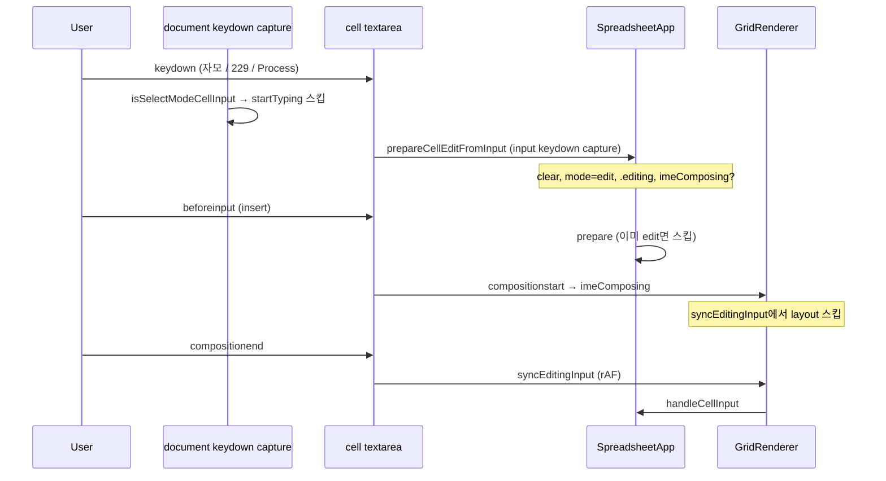

# 한글 IME 트러블슈팅

Vanilla JS 스프레드시트에서 `textarea` 기반 셀 편집 시 겪었던 **한글 입력기(IME)** 버그의 증상·원인·해결을 정리한 문서다.  
**구현 기준:** `js/SpreadsheetApp.js`, `js/ui/GridRenderer.js`, `js/utils/keyboard.js`, `style.css` (저장소 현재 코드와 대조해 유지).

## 증상

| 증상 | 예시 |
|------|------|
| Enter 후 조합 미완료 글자가 아래 셀로 이동 | A1에 `아이디어` 입력 후 Enter → A2에 `어`만 남음 |
| 자모가 분리되어 입력됨 | `임자` → `ㅇㅣㅁ자`처럼 조합되지 않음 |
| 기존 값 뒤에 글자가 붙음 | 셀에 `hello`가 있는데 선택 후 `안녕` 입력 → `hello안녕` |
| 첫 글자만 조합 실패 | 첫 입력은 깨지고, 지운 뒤 다시 치면 정상 |
| 선택 모드에서 첫 한글이 한 번 더 붙음 | `가방` 입력 → `ㄱ가방` (편집 모드로 들어간 뒤에는 정상) |

증상마다 원인이 달라 **항목별로** 나눠 수정했다. 선택 모드에서 바로 입력할 때의 이벤트 순서는 아래 「이벤트 순서」·§5를 보면 된다.

---

## 코드·문서 대응표

| 문서 절 | 코드 위치 | 핵심 심볼 |
|---------|-----------|-----------|
| §1 Enter | `GridRenderer.js` 셀 `keydown`(Enter), `SpreadsheetApp.bindGlobalEvents` | `isComposingInput`, `isEditingCellInputEvent` |
| §2 조합 중 레이아웃 | `GridRenderer.bindCellEvents` | `imeComposing`, `syncEditingInput`, `layoutEditingInput` |
| §3 덮어쓰기 | `SpreadsheetApp.prepareCellEditFromInput` | 값 clear, `select()` 미사용 |
| §4 포커스·readOnly | `SpreadsheetApp.updateCellsUI`, `focusSelectedCellInput` | `isActiveCell`, `readOnly` |
| §5 이중 입력 | `SpreadsheetApp.bindGlobalEvents` keydown capture | `isSelectModeCellInputEvent`, `startTypingInActiveCell` |

---

## 원인과 해결 요약

### 1. 조합 중 Enter 처리

**원인:** IME 조합이 끝나기 전 Enter로 `finishEditAndMoveDown`이 돌면, 확정되지 않은 음절만 반영된 채 아래 셀로 내려간다.

**해결 (코드와 일치):**

- 셀 `textarea` Enter: `isComposingInput()` 또는 `GridRenderer.isInputComposing()`이면 무시 (`GridRenderer.js` Enter 핸들러).
- 편집 중 Enter 확정·아래 이동: `model.mode === 'edit'`일 때만 셀 핸들러가 `finishEditAndMoveDown` 호출, `stopPropagation`으로 document와 분리.
- **선택 모드** Enter → 편집 진입: document `keydown`에서 `enterEditMode` (`isEditingCellInputEvent`가 false일 때, 즉 `.cell.editing`이 아닐 때).
- document 단축키 전체: `isEditingCellInputEvent()` — **`.cell.editing .cell-input`에 포커스가 있으면** document 쪽에서 return (선택 모드 포커스 `.cell:not(.editing)`와 구분).

**관련 파일:** `js/utils/keyboard.js`, `js/ui/GridRenderer.js`, `js/SpreadsheetApp.js`

---

### 2. 조합 중 DOM·모델 동기화 (`layoutEditingInput`)

**원인:** 편집 중 `layoutEditingInput()`이 textarea를 `position: fixed`로 옮기고 크기를 바꾼다. 조합 도중 레이아웃 변경·`handleCellInput` 호출이 IME 세션을 끊는다. `input`이 `compositionstart`보다 먼저 올 수도 있다.

**해결 (코드와 일치):**

- `compositionstart` / `compositionupdate` → `dataset.imeComposing = 'true'`
- `GridRenderer.isInputComposing()`이 true면 `syncEditingInput`에서 `layoutEditingInput`·`handleCellInput` **스킵**
- `compositionend` → `delete imeComposing` 후 `requestAnimationFrame`으로 한 번만 `syncEditingInput`
- `updateCellsUI()`는 편집 중 매 refresh마다 `layoutEditingInput`을 **호출하지 않음** (편집 셀은 `input` 이벤트·`needsEditingOverlay` 경로만)

**관련 파일:** `js/ui/GridRenderer.js`, `js/SpreadsheetApp.js` (`updateCellsUI`)

---

### 3. 선택 모드에서 덮어쓰기 실패

**원인:** 셀만 선택한 채 편집 모드로만 열리고 기존 텍스트가 남으면, 커서가 끝에 있어 새 글자가 **뒤에 붙는다**.

**해결 (코드와 일치):**

- `input.select()`로 덮어쓰기 시도하지 않음 (조합 깨짐, §4 참고).
- `prepareCellEditFromInput()`: `mode === 'select'`일 때만 동작, 기존 `input.value`·`model.data` **clear** 후 브라우저·IME가 입력.
- 트리거: `beforeinput` + `isCellInsertBeforeInput` (`GridRenderer.bindCellEvents`).
- **활성 셀에 포커스가 있는 선택 모드**에서는 document `startTypingInActiveCell`을 **쓰지 않음** (§5). 영문·한글·완성 음절 모두 `beforeinput` / IME 경로.
- **선택은 있으나 셀 textarea에 포커스가 없을 때**만 `startTypingInActiveCell` (그리드 밖 포커스 등).

**관련 파일:** `js/SpreadsheetApp.js`, `js/ui/GridRenderer.js`

---

### 4. 첫 글자만 조합 실패

**원인 (복합):**

| 요인 | 설명 |
|------|------|
| `readOnly` textarea | readonly면 IME 조합이 제대로 안 되는 브라우저가 많음 |
| `select()` on keydown | 첫 키 직후 전체 선택이 조합 타이밍과 충돌 |
| document만으로 편집 진입 | capture에서 포커스만 옮기면 해당 keydown이 input에 안 감 |
| `input`이 `compositionstart`보다 먼저 | 조합 플래그 없이 레이아웃·동기화가 먼저 돔 |

**해결 (코드와 일치):**

1. **`updateCellsUI()`** — 단일 셀 선택 시 활성 셀만 `readOnly = false` (`isActiveCell`). 나머지는 `readOnly = true`. 드래그 중(`drag.active`)에는 readOnly·레이아웃 갱신 생략(선택 UI만).
2. **`focusSelectedCellInput()`** — 단일 셀 선택·편집일 때만 활성 셀 `textarea`에 `focus({ preventScroll: true })`. 범위 선택(여러 칸)일 때는 포커스 안 가져감. 툴바·제목·가이드 모달 포커스 중에는 건너뜀.
3. **`prepareCellEditFromInput()`** — `beforeinput`(insert 계열), 필요 시 셀 `keydown` capture + `shouldRouteToImeInput`(자모·229·Process). 값 clear, `select()` 없음, 즉시 `.editing`·`readOnly` 해제. `expectComposition`일 때만 선행 `imeComposing`. `refreshSelectionUI`는 `queueMicrotask`.
4. **CSS** — `.cell-input[readonly] { pointer-events: none }`, `.cell-input[readonly]:focus { pointer-events: auto }`. 선택 모드 활성 셀은 `.cell.active-cell:not(.editing) .cell-input { caret-color: transparent }`.

**관련 파일:** `js/SpreadsheetApp.js`, `js/ui/GridRenderer.js`, `js/utils/keyboard.js`, `style.css`

---

### 5. 선택 모드에서 첫 한글 이중 입력 (`ㄱ가방`)

**원인:** 활성 셀 `textarea`에 포커스가 있는 **선택 모드**(`:not(.editing)`)에서 키를 누르면, **같은 keydown**에 두 경로가 겹쳤다.

| 순서 (capture, 바깥→안) | 경로 | 결과 |
|-------------------------|------|------|
| 1 | document `keydown` capture + `isTypingKey` | `startTypingInActiveCell('ㄱ')` — **먼저** 한 글자 삽입 |
| 2 | textarea `keydown` capture + `shouldRouteToImeInput` | `prepareCellEditFromInput` — 편집 전환·clear |
| 3 | `beforeinput` / IME | 조합 결과 `가방` 등 **다시** 삽입 → `ㄱ가방` |

편집 모드(이미 `.cell.editing`)에서는 `isSelectModeCellInputEvent`가 false라 document `startTyping`을 타지 않아 재현되지 않는다.

**해결 (코드와 일치):**

```javascript
// SpreadsheetApp.js — bindGlobalEvents, keydown capture
if (!isTypingKey(event)) return;
if (isSelectModeCellInputEvent(event)) return; // .cell:not(.editing) .cell-input
event.preventDefault();
this.startTypingInActiveCell(event.key);
```

- `isSelectModeCellInputEvent` — `keyboard.js`, `closest('.cell:not(.editing) .cell-input')`
- 포커스된 선택 모드 셀에서는 **한글·영문 구분 없이** `startTyping` 차단 → `beforeinput`·IME만 사용
- `prepareCellEditFromInput`은 이미 `mode === 'edit'`이면 return → keydown·beforeinput 이중 호출해도 한 번만 전환

**관련 파일:** `js/SpreadsheetApp.js` (`bindGlobalEvents`), `js/utils/keyboard.js`

---

## 이벤트 순서 (선택 모드 · 활성 셀 포커스 · 한글 자모)

capture는 **document → … → textarea** 순으로 내려간다. (예전 다이어그램처럼 textarea가 document보다 먼저가 **아님**.)



---

## 수정 시 피해야 할 패턴

- 편집·조합 중 **`layoutEditingInput` / `position: fixed` 남용**
- 선택 후 첫 입력에 **`input.select()`** 로 덮어쓰기
- 활성 셀을 **`readOnly`로 유지** (단일 셀 선택 시 해제 필요)
- document **`keydown`만**으로 편집 진입·첫 글자 처리 (타깃이 input이 아니면 IME 실패)
- 포커스된 선택 모드 셀에서 **`startTypingInActiveCell` + IME 동시** (§5)
- 조합 없이 **`imeComposing` 항상** 켜 두기
- `prepareCellEditFromInput` 없이 **`refreshSelectionUI`만**으로 편집 UI 기대

---

## 검증 체크리스트

- [ ] 빈 셀 선택(단일) → `가방`, `임자` — 앞에 자모 중복 없음 (§5)
- [ ] 같은 상태에서 영문 `abc` — `beforeinput`만으로 정상
- [ ] 값 있는 셀 선택 → `안녕` — 기존 값 **대체**, 뒤에 붙지 않음 (§3)
- [ ] 선택만 · Enter → 편집 진입 / 편집 중 Enter → 아래 셀 (§1)
- [ ] `아이디어` 입력 후 Enter — A2 비어 있음
- [ ] 편집 중 Cmd/Ctrl+Enter — 셀 안 줄바꿈
- [ ] 선택 모드 · 활성 셀 포커스 · 방향키 — 이동 (document capture + `isSelectModeCellInputEvent`)
- [ ] 범위 선택(여러 칸) — 활성 셀에 포커스 안 감, 드래그·화살표는 동작
- [ ] 동일 셀 재클릭 편집 — 긴 글 레이아웃

---

## 관련 API·함수 빠른 참조

| 심볼 | 파일 | 역할 |
|------|------|------|
| `isComposingInput` | `keyboard.js` | 조합 중 키 (229, Process 포함) |
| `shouldRouteToImeInput` | `keyboard.js` | 선택 모드 input capture — 자모·229·Process 시 prepare (완성 음절 한 글자는 false → beforeinput) |
| `isEditingCellInputEvent` | `keyboard.js` | `.cell.editing .cell-input` — document 단축키 제외 |
| `isSelectModeCellInputEvent` | `keyboard.js` | `.cell:not(.editing) .cell-input` — `startTyping` 제외 |
| `isCellInsertBeforeInput` | `keyboard.js` | `beforeinput` insert 계열 |
| `prepareCellEditFromInput` | `SpreadsheetApp.js` | 선택→편집, clear, ime 플래그 |
| `startTypingInActiveCell` | `SpreadsheetApp.js` | 셀 포커스 없는 선택 시 한 글자 시작 |
| `focusSelectedCellInput` | `SpreadsheetApp.js` | 단일 셀만 focus |
| `updateCellsUI` | `SpreadsheetApp.js` | readOnly·editing·하이라이트 (조합 중 layout 호출 안 함) |
| `syncEditingInput` | `GridRenderer.js` | input / compositionend 동기화 |
| `layoutEditingInput` | `GridRenderer.js` | 긴 텍스트 fixed 오버레이 (조합 중 스킵) |

---

## 참고

- 프롬프트 이력: [PROMPT_LOG.md](./PROMPT_LOG.md)
- 요구사항: [SRD.md](./SRD.md) · 구현: [TRD.md](./TRD.md) §7 (선택·편집·`refreshSelectionUI`)
