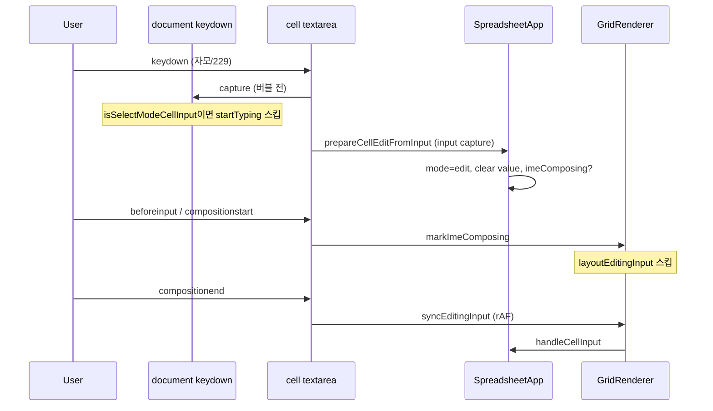

# 한글 IME 트러블슈팅

Vanilla JS 스프레드시트에서 `textarea` 기반 셀 편집 시 발생했던 **한글 입력기(IME)** 관련 버그의 증상, 원인, 해결 방법을 정리한 문서입니다.

## 증상

| 증상 | 예시 |
|------|------|
| Enter 후 조합 미완료 글자가 아래 셀로 이동 | A1에 `아이디어` 입력 후 Enter → A2에 `어`만 남음 |
| 자모가 분리되어 입력됨 | `임자` → `ㅇㅣㅁ자`처럼 조합되지 않음 |
| 기존 값 뒤에 글자가 붙음 | 셀에 `hello`가 있는데 선택 후 `안녕` 입력 → `hello안녕` |
| 첫 글자만 조합 실패 | 첫 입력은 깨지고, 지운 뒤 다시 치면 정상 |
| 선택 모드에서 첫 한글이 한 번 더 붙음 | `가방` 입력 → `ㄱ가방` (편집 모드로 들어간 뒤에는 정상) |

여러 원인이 겹쳐 있어 한 번의 수정으로 해결되지 않았고, **증상별로 원인을 나눠** 대응한 뒤 마지막에 **선택 모드 → 첫 입력** 경로를 정리했습니다.

---

## 원인과 해결 요약

### 1. 조합 중 Enter 처리

**원인:** IME 조합이 끝나기 전 `keydown` Enter로 `finishEditAndMoveDown`이 실행되면, 확정되지 않은 음절만 모델·DOM에 반영된 채 아래 셀로 이동한다.

**해결:**

- `isComposingInput()` (`isComposing`, `keyCode === 229`, `key === 'Process'`)일 때 Enter 무시
- 셀 `textarea`의 Enter는 `stopPropagation`으로 document 핸들러와 분리
- 편집 중 document 단축키는 `isEditingCellInputEvent()` — **`.cell.editing` 안의 input일 때만** 제외 (선택 모드 포커스와 구분)

**관련 파일:** `js/utils/keyboard.js`, `js/ui/GridRenderer.js`, `js/SpreadsheetApp.js`

---

### 2. 조합 중 DOM·모델 동기화 (`layoutEditingInput`)

**원인:** 편집 중 `layoutEditingInput()`이 textarea를 `position: fixed`로 옮기고 크기를 바꾼다. IME는 입력 요소의 안정적인 DOM 상태에 의존하므로, 조합 도중 레이아웃 변경·`handleCellInput` 호출이 조합 세션을 끊는다.  
또한 `input` 이벤트가 `compositionstart`보다 **먼저** 올 수 있어, 조합 시작 전에 레이아웃이 한 번 돌아가기도 한다.

**해결:**

- `compositionstart` ~ `compositionend` 동안 `dataset.imeComposing = 'true'`
- `GridRenderer.isInputComposing()`이 true이면 `syncEditingInput`에서 `layoutEditingInput`·`handleCellInput` 스킵
- `compositionend` 후 `requestAnimationFrame`으로 한 번만 동기화
- `updateCellsUI()`에서는 편집 중 매 refresh마다 `layoutEditingInput` 호출하지 않음

**관련 파일:** `js/ui/GridRenderer.js`, `js/SpreadsheetApp.js` (`updateCellsUI`)

---

### 3. 선택 모드에서 덮어쓰기 실패

**원인:** 셀만 선택한 상태에서 입력 시 편집 모드만 열리고 기존 텍스트가 그대로면, 커서가 끝에 있어 새 글자가 **뒤에 append** 된다. 스프레드시트에서는 선택 후 타이핑 시 **셀 전체를 새 내용으로 교체**해야 한다.

**해결:**

- 입력 시작 시 `input.select()`로 덮어쓰기를 시도하지 않음 (첫 조합을 깨뜨림, 아래 4번 참고)
- `prepareCellEditFromInput()`에서 **기존 값을 clear** (`input.value`·`model.data` 비움) 후 IME/브라우저가 새로 입력
- 완성된 한글 음절 한 글자·영문 등은 **활성 셀에 포커스가 없을 때만** `startTypingInActiveCell()`로 한 글자 교체 (아래 5번 참고)

**관련 파일:** `js/SpreadsheetApp.js` (`prepareCellEditFromInput`, `startTypingInActiveCell`)

---

### 4. 첫 글자만 조합 실패

**원인 (복합):**

| 요인 | 설명 |
|------|------|
| `readOnly` textarea | WebKit/Chrome 등에서 **readonly 필드는 IME 조합이 제대로 시작되지 않음** |
| `select()` on keydown | 첫 키 직후 전체 선택이 조합 시작 타이밍과 충돌 |
| document에서 포커스 이동 | capture 단계에서만 focus를 옮기면 **해당 keydown은 textarea에 전달되지 않음** |
| `input`이 `compositionstart`보다 먼저 | 조합 플래그 없이 `layoutEditingInput` 실행 |

**해결 (현재 구조):**

1. **활성 셀만 `readOnly` 해제**  
   `updateCellsUI()`에서 단일 셀 선택 시 포커스 셀(`isActiveCell`)은 `readOnly = false`, 나머지 셀만 `readOnly = true`.

2. **선택 시 활성 셀 textarea에 포커스 유지**  
   `refreshSelectionUI()` → `focusSelectedCellInput()` (툴바·제목 편집 중에는 포커스 빼앗지 않음).

3. **입력 직전 편집 전환 — `prepareCellEditFromInput()`**  
   - `beforeinput` (insert 계열)  
   - IME용 `keydown` capture (`shouldRouteToImeInput`)  
   - 기존 값 clear, `select()` 없음, 편집 클래스·`readOnly` 즉시 해제  
   - 조합이 예상될 때만 `imeComposing` 플래그 (`insertCompositionText` 등)  
   - 무거운 `refreshSelectionUI`는 `queueMicrotask`로 지연

4. **CSS**  
   `readonly` 셀은 `pointer-events: none`이나, `:focus` 시 `pointer-events: auto` (포커스된 활성 셀 클릭·키 입력 보조).

**관련 파일:** `js/SpreadsheetApp.js`, `js/ui/GridRenderer.js`, `js/utils/keyboard.js`, `style.css`

---

### 5. 선택 모드에서 첫 한글 이중 입력 (`ㄱ가방`)

**원인:** 활성 셀 `textarea`에 포커스가 있는 선택 모드에서 한글을 치면, 이벤트가 두 갈래로 겹친다.

1. **document `keydown`(capture)** — `isTypingKey`로 판별되면 `startTypingInActiveCell()`이 **첫 키(자모 `ㄱ` 등)를 먼저** `input.value`·`model.data`에 넣는다.
2. **`beforeinput` / IME** — `prepareCellEditFromInput()`으로 편집 전환·값 clear 후, 브라우저 IME가 조합 결과(`가방` 등)를 다시 넣는다.

document 핸들러가 input보다 **먼저** 실행되므로, 편집 모드(이미 `.cell.editing`)에서는 `startTyping` 경로를 타지 않아 문제가 없고, **선택 모드 + 활성 셀 포커스**일 때만 재현된다.

**해결:**

- document `keydown`에서 타이핑 처리 직전, `isSelectModeCellInputEvent(event)`이면 **`startTypingInActiveCell` 호출하지 않음** (return).
- 해당 경우 입력은 **`beforeinput` → `prepareCellEditFromInput`** 과 셀 쪽 IME `keydown` capture(`shouldRouteToImeInput`)만 담당.
- 그리드 밖에 포커스가 있거나 셀 포커스 없이 키를 칠 때는 기존처럼 `startTypingInActiveCell` 유지.

```javascript
// SpreadsheetApp.js — document keydown (capture) 일부
if (isSelectModeCellInputEvent(event)) {
  return;
}
event.preventDefault();
this.startTypingInActiveCell(event.key);
```

**관련 파일:** `js/SpreadsheetApp.js` (`bindGlobalEvents`), `js/utils/keyboard.js` (`isSelectModeCellInputEvent`, `isTypingKey`)

---

## 데이터·이벤트 흐름 (선택 모드 → 한글 첫 입력)



---

## 수정 시 피해야 할 패턴

- 편집 중·조합 중 **`layoutEditingInput` / `position: fixed` 남용**
- 선택 후 첫 입력에 **`input.select()`** 로 덮어쓰기 시도
- 선택된 활성 셀 textarea를 **`readOnly`로 유지**
- document **`keydown`만**으로 편집 진입 후 첫 키를 IME에 맡기기 (이벤트 타깃이 input이 아님)
- 포커스된 활성 셀에서 **`startTypingInActiveCell`과 IME가 동시에** 첫 자모를 넣기 (`ㄱ가방` 중복)
- 조합 여부와 관계없이 **`imeComposing` 항상 설정** (영문 입력 후 레이아웃이 안 맞을 수 있음)

---

## 검증 체크리스트

- [ ] 빈 셀 선택 → `가방`, `임자`, `아이디어` — **첫 글자부터** 정상 조합(앞에 자모 한 번 더 붙지 않음)
- [ ] 값 있는 셀 선택 → `안녕` — **기존 값 대체**, 뒤에 붙지 않음
- [ ] `아이디어` 입력 후 Enter — A2 비어 있고 포커스만 A2
- [ ] 편집 중 Cmd/Ctrl+Enter — 셀 내 줄바꿈
- [ ] 선택 모드에서 화살표·Cmd/Ctrl+C/V·Z — document 단축키 동작
- [ ] 더블클릭(또는 동일 셀 재클릭) 편집 — 기존 내용 편집·긴 글 레이아웃

---

## 관련 API·함수 빠른 참조

| 심볼 | 파일 | 역할 |
|------|------|------|
| `isComposingInput` | `keyboard.js` | 조합 중 키 이벤트 판별 |
| `shouldRouteToImeInput` | `keyboard.js` | 자모·229 등 IME 경로 (완성 음절 한 글자 제외) |
| `isEditingCellInputEvent` | `keyboard.js` | `.cell.editing` 기준 document 키 제외 |
| `isSelectModeCellInputEvent` | `keyboard.js` | 선택 모드 포커스 셀 — `startTyping` 제외 |
| `isCellInsertBeforeInput` | `keyboard.js` | `beforeinput` insert 타입 판별 |
| `prepareCellEditFromInput` | `SpreadsheetApp.js` | 선택→편집·clear·ime 플래그 |
| `focusSelectedCellInput` | `SpreadsheetApp.js` | 활성 셀 포커스 |
| `syncEditingInput` | `GridRenderer.js` | input/compositionend 동기화 |
| `layoutEditingInput` | `GridRenderer.js` | 긴 텍스트 fixed 오버레이 (조합 중 스킵) |

---

## 참고

- 개발 프롬프트 이력: [PROMPT_LOG.md](./PROMPT_LOG.md) (한글 IME 항목 통합)
- 키보드·선택 동작 요구: [SRD.md](./SRD.md), 구현 상세: [TRD.md](./TRD.md)
