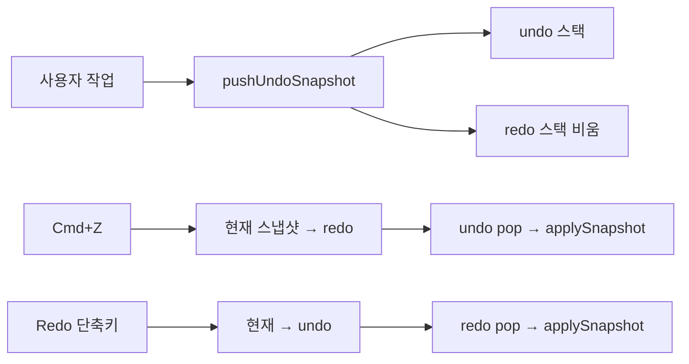

# 실행 취소·다시 실행 (Undo / Redo)

이 문서는 미니 스프레드시트에 구현된 undo/redo 방식, 코드 위치, 동작 규칙, 성능·확장 시 우려 지점을 정리합니다.  
요구사항 요약은 [SRD.md](./SRD.md) §2.6, 기술 개요는 [TRD.md](./TRD.md) §11을 참고하세요.

---

## 1. 개요

| 항목 | 내용 |
|------|------|
| 패턴 | **스냅샷 + 이중 스택** (Command 객체 패턴 아님) |
| 되돌리는 단위 | 그리드 `{ rows, cols, data }` 전체 |
| 제외 | 시트 **제목** (`title`) — undo/redo 대상 아님 |
| 최대 단계 | 100 (`MAX_UNDO_STACK`, `js/constants.js`) |
| 단축키 | Cmd/Ctrl+Z (취소), Cmd/Ctrl+Shift+Z·Ctrl+Y (다시 실행) |

**한 줄 요약:** 변경 **직전** 상태를 사진(스냅샷)으로 undo 스택에 쌓고, 실행 취소 시 **현재** 상태는 redo 스택에 넣은 뒤 undo 스택 맨 위 스냅샷으로 모델·UI를 통째로 복원합니다.

---

## 2. 관련 파일

| 파일 | 역할 |
|------|------|
| `js/models/UndoStack.js` | undo/redo 스택, push·pop, 중복 스냅샷 생략 |
| `js/models/SpreadsheetModel.js` | `createSnapshot`, `applySnapshot`, `collectData` |
| `js/SpreadsheetApp.js` | `pushUndoSnapshot`, `undo`/`redo`, push 시점, 편집 플래그 |
| `js/utils/keyboard.js` | `isUndoShortcut`, `isRedoShortcut` |
| `js/constants.js` | `MAX_UNDO_STACK` |

---

## 3. 스냅샷 구조

```javascript
// SpreadsheetModel.createSnapshot()
{
  rows: number,
  cols: number,
  data: string[][],  // collectData() — 행마다 [...row] 얕은 복사
}
```

- `applySnapshot`: `rows`/`cols`/`data` 덮어쓰기, `mode = 'select'`, `clampSelection()`으로 선택 범위 보정.
- 문자열 셀 값은 불변이라, **내용이 안 바뀐 셀**은 여러 스냅샷이 같은 문자열 참조를 공유할 수 있습니다. 내용이 바뀌면 새 문자열이 쌓입니다.

---

## 4. UndoStack 동작

### 4.1 push

1. undo 스택 **맨 위**와 새 스냅샷이 `snapshotsEqual`이면 push **생략**.
2. 아니면 undo 스택에 push.
3. 길이가 `maxSize`(100)를 넘으면 `shift()`로 가장 오래된 항목 제거.
4. **`redoStack = []`** — 새 분기가 생기면 다시 실행 경로는 무효.

### 4.2 undo(currentSnapshot)

1. undo 스택이 비어 있으면 `null`.
2. **현재** `currentSnapshot`을 redo 스택에 push.
3. undo 스택에서 `pop()`한 스냅샷 반환 → 호출 측에서 `applySnapshot`.

### 4.3 redo(currentSnapshot)

undo와 대칭: 현재를 undo 스택에 push, redo에서 pop.

### 4.4 스냅샷 동등 비교

`rows`, `cols`가 같고, 모든 `(row, col)` 셀 문자열이 `===`로 같을 때만 동일로 간주합니다. push마다 **O(rows × cols)** 비교가 들어갑니다.

---

## 5. SpreadsheetApp 연동

### 5.1 저장 (push)

```text
pushUndoSnapshot()
  → history.push(model.createSnapshot())
  → updateHistoryButtons()
```

### 5.2 실행 취소 / 다시 실행

```text
undo() / redo()
  → syncActiveCellFromInput()   // 편집 중 textarea → model.data
  → blurActiveCellInput()
  → history.undo/redo(model.createSnapshot())
  → applySnapshot(snapshot)     // model + grid.render() + persist() + 버튼 갱신
```

- undo/redo 직후 **localStorage 즉시 저장** (`persist()`). 일반 입력은 300ms debounce(`scheduleSave`)와 다릅니다.

### 5.3 툴바·키보드

- `#undo-btn`, `#redo-btn`: `history.canUndo()` / `canRedo()`로 `disabled`.
- `document` capture `keydown`: `isGridKeyboardTarget`이 false면 그리드 단축키(undo 포함) 무시 (툴바·가이드 모달 포커스 등).

---

## 6. 스냅샷을 넣는 시점 (push)

**원칙:** 데이터·그리드 크기를 **바꾸기 직전**에 `pushUndoSnapshot()`.

| 작업 | 호출 경로 |
|------|-----------|
| 행·열 추가·삭제 | `mutateGrid()` 맨 앞 |
| 붙여넣기 | `pasteTable()` |
| 선택 영역 삭제 (Backspace) | `clearSelectedContent()` |
| 선택 모드에서 타이핑 시작 | `startTypingInActiveCell()` |
| IME/beforeinput으로 편집 진입 | `prepareCellEditFromInput()` |
| 편집 중 값 변경 (첫 변경만) | `handleCellInput()` → `ensureEditUndoSnapshot()` |

`mutateGrid` 예:

```javascript
mutateGrid(mutator) {
  this.pushUndoSnapshot();
  mutator();
  this.grid.render();
  this.persist();
}
```

### 6.1 셀 편집 — 한 세션당 스냅샷 1개

- `editUndoRecorded`: 이미 이번 편집에서 push 했으면 `ensureEditUndoSnapshot()`은 스킵.
- 편집 종료(`exitEditMode`), 스냅샷 적용(`applySnapshot`) 등에서 `false`로 리셋.
- **글자마다** undo 스택에 쌓이지 않음 → undo 한 번에 「편집 시작 전 셀 내용」으로 복귀.

---

## 7. 데이터 흐름 (다이어그램)



---

## 8. 성능·부하 우려

### 8.1 왜 부담이 생기는가

| 시점 | 비용 |
|------|------|
| **push** | 전체 `rows×cols` 배열 복사 + (맨 위와 다를 때) 전 셀 `snapshotsEqual` |
| **undo/redo** | 현재 스냅샷 복사 + 복원 스냅샷으로 `applySnapshot` 시 **또** 행 배열 복사 |
| **메모리** | undo 스택 최대 **100** × (시트 1벌 분량) 상한 (내용이 달라질수록 문자열 heap 증가) |
| **저장** | `applySnapshot`마다 `JSON.stringify` 전체 시트 → **localStorage** (브라우저 할당량·직렬화 시간) |
| **DOM** | `grid.render()` — 행·열 수가 같으면 `syncCellValues`만, 크기 변경 시 전체 재렌더 |

그리드 **최대 행·열 상한은 없음** (`ensureGridSize`, 붙여넣기·행열 삽입으로 확장 가능). 기본값은 5×5(`CONFIG`)이나, 대량 paste 시 셀 수가 급증할 수 있습니다.

### 8.2 현재 완화 장치

1. 스택 깊이 **100** 고정.
2. 동일 스냅샷 **중복 push 생략**.
3. 셀 편집은 **세션당 push 1회**.
4. 렌더는 크기 동일 시 **값만 동기화** (`GridRenderer.render`).

### 8.3 부담이 커지는 사용 예

- 수백×수백 이상 격자 + 셀마다 긴 텍스트.
- 붙여넣기·행열 조작을 **많이** 해 undo 스택 100칸이 모두 **서로 다른** 대형 시트인 경우.
- undo를 연속으로 눌러 `persist()`·`render()`가 반복되는 경우.

**미니 시트 + 소규모 데이터**에서는 구현 단순성 대비 실용적으로 충분한 수준입니다. Excel급 대용량은 **의도적 트레이드오프**입니다.

### 8.4 확장 시 검토할 개선 (미구현)

| 방향 | 설명 |
|------|------|
| 변경분만 저장 | 전체 `data` 대신 diff/patch 또는 변경 영역 bounding box만 스냅샷 |
| 상한 | `MAX_ROWS` / `MAX_COLS` / 셀당 최대 글자 수 |
| undo 시 저장 | `persist()`를 debounce하거나 undo 전용 플래그로 묶기 |
| 제목 포함 | 필요 시 스냅샷에 `title` 필드 추가 (현재 SRD·README와 불일치 주의) |

---

## 9. 알려진 제한 (요구사항과 일치)

- 시트 제목 변경은 undo 대상이 **아님** ([SRD.md](./SRD.md) FR-034, [README.md](../README.md)).
- 선택 상태(`anchor`/`focus`/`selectionKind`)는 스냅샷에 없음. 복원 후 `clampSelection()`으로 범위만 맞춤.
- 편집 undo는 **한 편집 세션 = undo 1단계** (글자 단위 undo 아님).

---

## 10. 다른 프로젝트에 옮길 때 최소 골격

```javascript
class History {
  undoStack = [];
  redoStack = [];
  push(snap) {
    this.undoStack.push(snap);
    this.redoStack = [];
  }
  undo(current) {
    if (!this.undoStack.length) return null;
    this.redoStack.push(current);
    return this.undoStack.pop();
  }
  redo(current) {
    if (!this.redoStack.length) return null;
    this.undoStack.push(current);
    return this.redoStack.pop();
  }
}

// 사용: 변경 전 history.push(clone(state)); undo 시 clone(state)를 넘기고 pop 결과로 state 복원 + UI 갱신
```

이 저장소에서는 위 골격에 `SpreadsheetModel` 스냅샷, `GridRenderer.render`, 편집 input 동기화, push 타이밍(`mutateGrid`·편집 플래그)이 추가된 형태입니다.

---

## 11. 관련 문서

- [README.md](../README.md) — 사용자용 단축키·undo 대상 요약
- [TRD.md](./TRD.md) §11 — 기술 요약 표
- [SRD.md](./SRD.md) §2.6 — 기능 요구 FR-033~034
