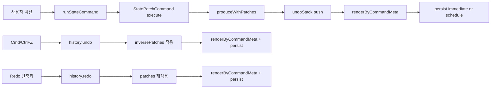

# 실행 취소·다시 실행 (Undo / Redo)

이 문서는 미니 스프레드시트의 현재 undo/redo 구현(하이브리드: Immer Patch + Command)과 실제 코드 동작을 기준으로 정리합니다.  
요구사항 요약은 [SRD.md](./SRD.md) §2.6, 기술 개요는 [TRD.md](./TRD.md) §11을 참고하세요.

---

## 1. 개요

| 항목 | 내용 |
|------|------|
| 패턴 | **Immer Patch + Command + 이중 스택** (`StatePatchCommand`, `PatchHistory`) |
| 되돌리는 단위 | patch / inversePatch (RFC 6902 경로 기반) |
| 제외 | 시트 **제목** (`title`) — undo/redo 대상 아님 |
| 최대 단계 | 100 (`MAX_UNDO_STACK`, `js/constants.js`) |
| 단축키 | Cmd/Ctrl+Z (취소), Cmd/Ctrl+Shift+Z·Ctrl+Y (다시 실행) |

**한 줄 요약:** 사용자 동작을 `StatePatchCommand`로 기록하고, 최초 실행 시 생성한 `patches`/`inversePatches`를 undo/redo에서 재사용해 최소 변경만 복원합니다.

---

## 2. 관련 파일

| 파일 | 역할 |
|------|------|
| `js/models/commands/StatePatchCommand.js` | `produceWithPatches`/`applyPatches`, command 메타(`changedCells`, `structureChanged`) 생성 |
| `js/models/PatchHistory.js` | command 기반 undo/redo 스택 |
| `js/models/SnapshotHistory.js` | 스냅샷 방식 호환용 래퍼(`USE_PATCH_HISTORY=false`일 때) |
| `js/models/SpreadsheetModel.js` | `createPatchState`, `applyPatchState` |
| `js/models/statePatchMutators.js` | 셀/붙여넣기/행열 삽입·삭제 mutator |
| `js/SpreadsheetApp.js` | `runStateCommand`, 액션별 command 실행, undo/redo 진입점 |
| `js/ui/GridRenderer.js` | `renderByCommandMeta` 기반 부분 렌더 |
| `js/services/PerfTracker.js` | command/undo/redo/render/persist 계측 로그 |
| `js/constants.js` | `MAX_UNDO_STACK`, `USE_PATCH_HISTORY`, `ENABLE_PERF_LOG` |

---

## 3. 실행 구조

```javascript
new StatePatchCommand(actionName, (draftState) => {
  // draftState.rows/cols/data/selection...
  // statePatchMutators 함수로 상태 변경
});
```

- 최초 `execute`에서 Immer `produceWithPatches`로 `patches`/`inversePatches`를 생성합니다.
- 이후 redo는 저장된 `patches`, undo는 `inversePatches`를 `applyPatches`로 적용합니다.
- patch 경로를 파싱해 변경 셀 메타를 만들고(`changedCells`), 렌더러가 부분 갱신에 사용합니다.

---

## 4. PatchHistory 동작

### 4.1 execute(command, model)

1. `command.execute(model)` 실행
2. command를 `undoStack`에 push
3. 스택이 100 초과 시 오래된 항목 제거(`shift`)
4. 새 분기 생성으로 `redoStack = []`

### 4.2 undo(model)

1. undo 가능 여부 확인
2. `undoStack.pop()`으로 command 획득
3. `command.undo(model)` 실행
4. command를 `redoStack`에 push

### 4.3 redo(model)

1. redo 가능 여부 확인
2. `redoStack.pop()`으로 command 획득
3. `command.execute(model)` 재실행(저장된 patches 재사용)
4. command를 `undoStack`에 push

---

## 5. SpreadsheetApp 연동

### 5.1 공통 실행 경로

```text
runStateCommand(actionName, mutator, persistMode)
  → new StatePatchCommand(...)
  → history.execute(command, model)
  → grid.renderByCommandMeta(command.meta)
  → persistMode 기준 저장(immediate 또는 schedule)
  → 히스토리 버튼 상태 갱신
```

### 5.2 undo / redo 경로

```text
undo() / redo()
  → syncActiveCellFromInput()     // 편집 중 textarea → model.data 동기화
  → blurActiveCellInput()
  → history.undo(model) / history.redo(model)
  → grid.renderByCommandMeta(command.meta)
  → persist()                     // 즉시 저장
  → 히스토리 버튼 상태 갱신
```

### 5.3 액션별 persist 정책

- `persistMode: 'schedule'`
  - `셀 값 변경`, `텍스트 입력 시작`, `선택 입력 시작`
- `persistMode: 'immediate'`
  - `선택 영역 비우기`, `표 붙여넣기`, 행/열 삽입·삭제 계열

### 5.4 툴바·키보드

- `#undo-btn`, `#redo-btn`: `history.canUndo()` / `canRedo()`로 `disabled`.
- `document` capture `keydown`: `isGridKeyboardTarget`이 false면 그리드 단축키(undo 포함) 무시.

---

## 6. command가 쌓이는 주요 시점

**원칙:** 데이터 또는 구조를 바꾸는 사용자 액션은 `runStateCommand(...)`로 실행합니다.

| 작업 | 액션명 | mutator |
|------|--------|---------|
| 선택 모드 입력 시작 | `선택 입력 시작` | 인접 코드 inline mutator + `setCellValue` |
| 선택 모드 타이핑 시작 | `텍스트 입력 시작` | `setCellValue` |
| 셀 입력 변경 | `셀 값 변경` | `setCellValue` |
| 선택 영역 삭제 | `선택 영역 비우기` | `clearSelectionContent` |
| 표 붙여넣기 | `표 붙여넣기` | `pasteTableAt` |
| 행 삽입 | `행 위/아래 삽입` | `insertRowsAt` |
| 열 삽입 | `열 왼쪽/오른쪽 삽입` | `insertColumnsAt` |
| 행 삭제 | `행 삭제/행 범위 삭제` | `deleteRowRange` |
| 열 삭제 | `열 삭제/열 범위 삭제` | `deleteColumnRange` |

---

## 7. 데이터 흐름 (현재)



---

## 8. 성능·검증 기준선

### 8.1 계측 항목

| 시점 | 측정 항목 |
|------|-----------|
| command 실행 | `command:<액션명>` |
| undo/redo | `undo`, `redo` |
| 저장 | `persist` |
| 렌더 | `render:<액션명>`, `render(undo)`, `render(redo)` |

### 8.2 계측 방법

1. `js/constants.js`에서 `ENABLE_PERF_LOG = true`.
2. DevTools Console에서 `[perf]` 로그 확인.
3. 시나리오 고정:
   - 100x100, 200x200 그리드에서 긴 문자열 붙여넣기
   - 행/열 다중 삽입·삭제 20회
   - undo/redo 연속 50회
4. 평균/최대 `undo`, `redo`, `persist`, `render` 시간을 비교.

### 8.3 주의 구간

- 대형 격자 + 긴 문자열 + 빈번한 구조 변경이 겹치면 비용이 증가합니다.
- 구조 변경(`rows`/`cols` 변경) command는 부분 렌더 대신 전체 렌더로 전환될 수 있습니다.

---

## 9. 알려진 제한 (요구사항과 일치)

- 시트 제목 변경은 undo 대상이 **아님** ([SRD.md](./SRD.md) FR-034, [README.md](../README.md)).
- **시트 초기화**(`resetSheet`)는 히스토리를 `clear()`하며, 초기화 자체는 undo로 복구하지 않습니다.
- `USE_PATCH_HISTORY=false`로 내리면 `SnapshotHistory` 경로로 동작하지만, 기본값은 `true`입니다.

---

## 10. 다른 프로젝트에 옮길 때 최소 골격 (현재 방식)

```javascript
class PatchHistory {
  undoStack = [];
  redoStack = [];
  execute(command, model) {
    command.execute(model);
    this.undoStack.push(command);
    this.redoStack = [];
  }
  undo(model) {
    const command = this.undoStack.pop();
    if (!command) return null;
    command.undo(model);
    this.redoStack.push(command);
    return command;
  }
  redo(model) {
    const command = this.redoStack.pop();
    if (!command) return null;
    command.execute(model);
    this.undoStack.push(command);
    return command;
  }
}
```

핵심은 **행동 맥락은 Command**, **미시 변경은 Patch**로 분리하는 하이브리드 구조입니다.

---

## 11. 관련 문서

- [README.md](../README.md) — 사용자용 단축키·undo 대상 요약
- [TRD.md](./TRD.md) §11 — 기술 요약 표
- [SRD.md](./SRD.md) §2.6 — 기능 요구 FR-033~034

---

## 12. 피드백 반영 요약 (A → B)

대형 시트(100x100+)와 긴 문자열 환경에서, 전체 스냅샷 복제/비교/직렬화의 `O(Rows × Cols)` 비용이 커질 수 있다는 피드백을 반영했습니다.

- A안 검토: **Command 기반 Delta 기록** (행동 맥락 보존 강점, 개별 커맨드 보일러플레이트 증가 한계)
- B안 검토: **Patch/Diff(Immer) 기반 기록** (자동 diff 강점, 단독 사용 시 행동 맥락 유실 우려)
- 최종 적용: **하이브리드(Immer Patch + Command)**  
  `StatePatchCommand` 1종으로 행동 이름은 Command가 담당하고, 미시 변경 이력은 Immer `produceWithPatches`가 자동 생성
- 적용 결과: undo/redo는 `patches`/`inversePatches`를 재사용해 최소 변경만 복원하고, 렌더링도 변경 셀 중심 부분 갱신으로 전환

### 변경 요약 (A → B)

- **A(기존):** 스냅샷 중심 UndoStack (`createSnapshot/applySnapshot`, 전체 비교/복원)
- **B(현재):** `PatchHistory + StatePatchCommand + Immer patches` 기반 최소 변경 복원 구조
